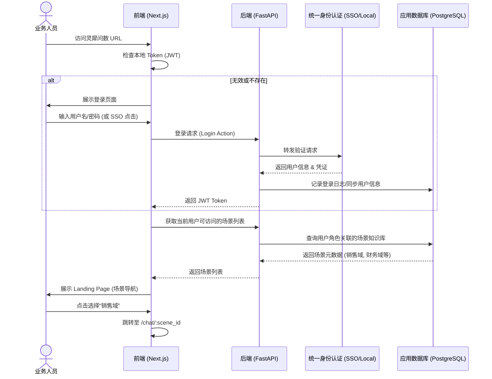
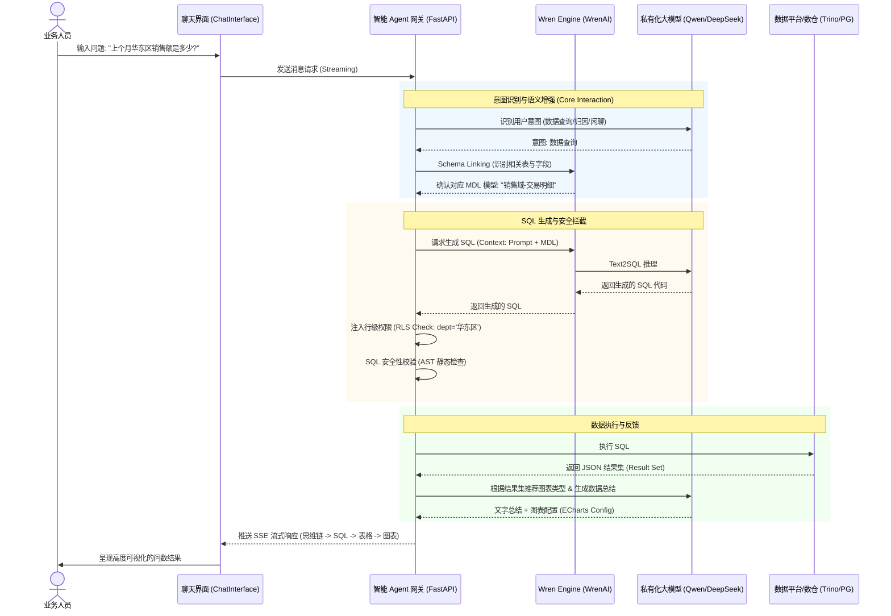
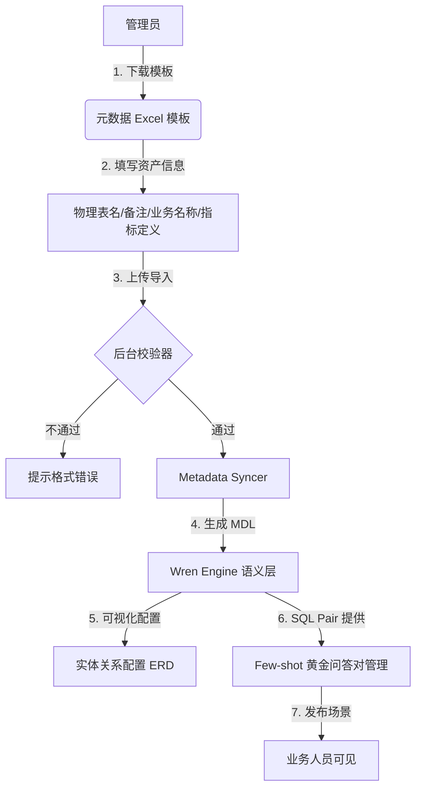
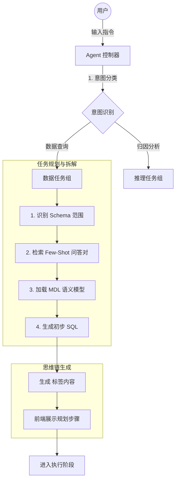
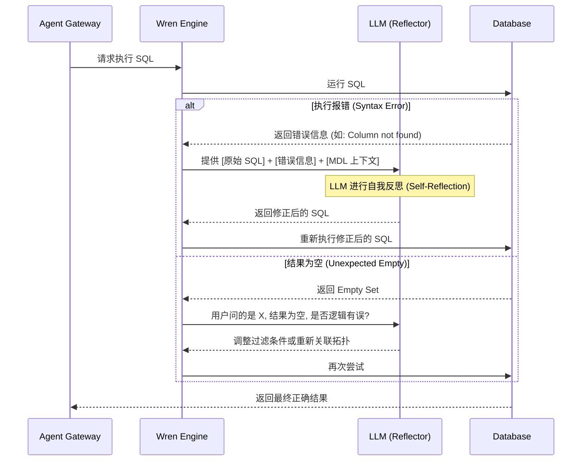
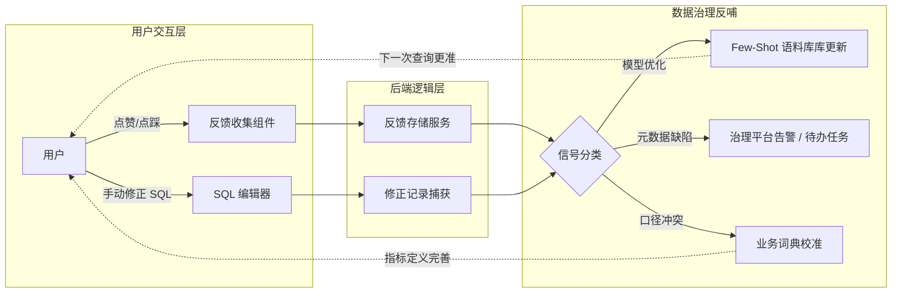
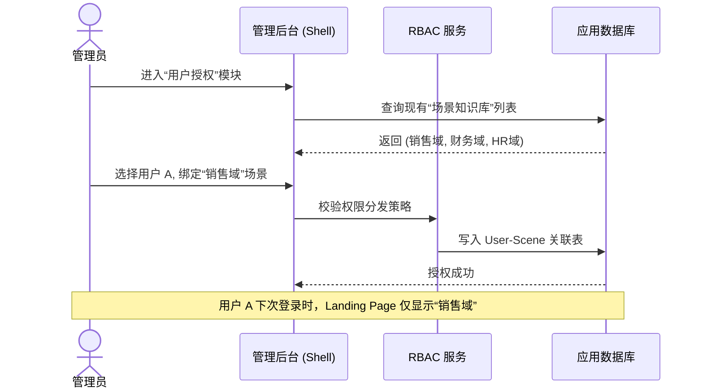

# 第一阶段（MVP）业务流程图

本项目第一阶段的目标是实现“领域 Copilot”，验证端到端 Text-to-Data 的可行性。以下是核心业务流程的图解。

## 1. 用户登录与场景导航流程

描述从用户访问系统、身份验证到进入特定业务场景（如“销售域”）的过程。

---

## 2. 端到端智能问数 (Text-to-Data) 流程

这是最核心的业务闭环，展示了如何从自然语言产生业务数据结论。

---

## 3. 管理端：元数据初始化与建模流程

描述管理员在第一阶段如何快速搭建一个业务域问数服务。

---

## 流程说明

1.  **关于权限**：流程图 2 中体现了“语义级 RLS”，即后端在生成的 SQL 执行前，会根据用户身份动态追加过滤条件，确保数据的隔离性。
2.  **关于流式渲染**：前端采用 SSE 协议，使得“思考过程”和“最终结论”能够分步呈现出来，极大减少了用户等待的焦虑感。
3.  **关于建模**：第一阶段主要依靠手动维护的 Excel 模板进行元数据注入，后期将通过 API 对接数据治理平台实现自动化。

---

## 4. 智能 Agent 任务规划流程 (Agent Planning)

展示 Agent 如何将用户模糊的自然语言指令拆解为可执行的任务链。

---

## 5. SQL 自愈与错误修正流程 (Self-Correction)

描述当 SQL 执行失败或结果不符合预期时，系统的自动反思与修正机制。

---

## 6. 用户反馈与治理信号回流流程 (Governance Loop)

体现“以用促管”的闭环，将前端应用的使用信号反哺至后端模型与治理端。

---

## 7. 场景权限管理与授权流程 (Permissions)

描述管理员如何对用户、角色和场景知识库进行关联授权。

