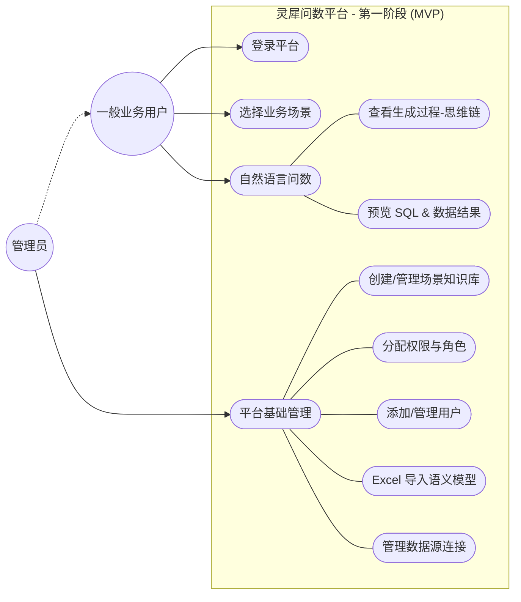

# 灵溪问数第一阶段用例图 (Use Case Diagrams)

根据第一阶段（MVP）的核心目标，系统主要服务于两类角色：**管理员用户**与**一般业务用户**。以下是针对这两个关键流程的用例图定义。

## 1. 第一阶段总体用例图

该图展示了管理员与普通用户在系统中的核心职责边界。

---

## 2. 核心流程用例说明

### (1) 管理员管理流程
管理员是系统的“搭建者”，负责将底层数据资产转化为 AI 可理解的业务场景。
- **关键操作**：
    - **创建场景知识库**：为不同业务域（如销售、财务）隔离配置环境。
    - **通过 Excel 导入模型**：在没有全自动同步前，支持通过标准模板注入元数据、指标定义和表关联。
    - **分配权限**：确定哪些用户可以看到哪些敏感业务域。

### (2) 一般用户问数流程
普通用户是系统的“消费者”，通过对话获取数据洞察。
- **关键体验**：
    - **过程可视化**：看到 Agent 是如何一步步思考并拆解任务的。
    - **结果闭环**：不仅看到数字，还能看到产生数字的 SQL 代码以及对应的图表展现。
