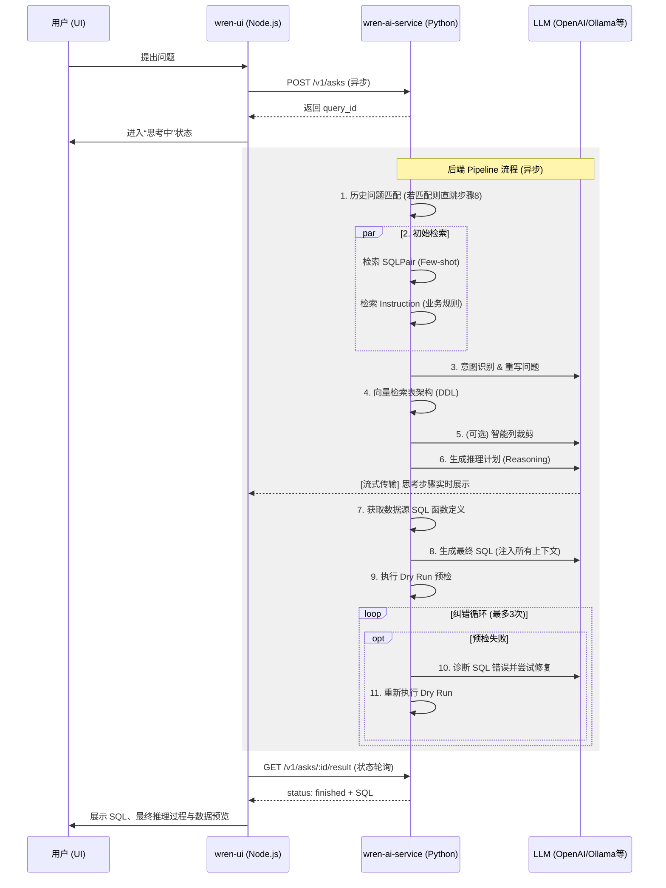

# WrenAI 请求-响应流程全栈详解

本文档提供从用户在 UI 提问到最终生成 SQL 答案的全流程解析，涵盖了前端协调、后端 AI 管道、以及 **SQLPair (Few-shot)** 与 **Instruction (知识库)** 的深度细节。

## 1. 整体架构与流程入口

WrenAI 的处理流程跨越了 **wren-ui** (Apollo Server) 和 **wren-ai-service** (FastAPI) 两个核心组件。

### 阶段一：前端捕获与任务初始化
1.  **用户提问**: 用户在 UI 输入问题并提交。
2.  **GraphQL 触发**: `wren-ui` 发起 mutation 触发 [AskingService](../wren-ui/src/apollo/server/services/askingService.ts)。
3.  **API 调用**: UI 服务端通过 `WrenAIAdaptor` 向 `wren-ai-service` 发起 `POST /v1/asks` 请求。
4.  **快速响应**: `wren-ai-service` 返回一个唯一的 `query_id`，UI 立即将此 ID 反馈给前端并进入轮询状态。

---

## 2. 核心 AI 管道逻辑 (后台异步处理)

一旦接收到请求，`AskService` 会在后台启动一套基于 Pipeline 的复杂逻辑处理。

### 阶段二：历史与背景检索 (Initial Retrieval)
这是后台处理的第一步，旨在快速返回结果或为后续准备知识。
-   **历史问题匹配 (Historical Check)**: 
    -   系统首先检查是否有人问过**完全相同**的问题。
    -   **逻辑**: 如果匹配成功且存在已验证的 SQL，则直接进入 `finished` 状态并返回结果，跳过后续所有 AI 步骤。
-   **并发知识获取 (Parallel Retrieval)**:
    -   如果没有历史匹配，则并行启动 `SQLPair` (Few-shot 示例) 和 `Instruction` (业务指令) 的检索。
    -   **SQLPair**: 提供类似问题的参考 SQL 风格。
    -   **Instruction**: 提供项目全局规则和特定业务约束。

### 阶段三：意图识别与问题重写 (Intent Classification)
-   **核心逻辑**: 结合上一步检索到的 **SQL SAMPLES** 和 **USER INSTRUCTIONS**，LLM 解析用户意图。
-   **问题重写 (Rephrase)**: 结合对话历史，将用户的短语或追问重写为独立的完整问题。
-   **意图分类**: 判断属于 `TEXT_TO_SQL`、`GENERAL`、`USER_GUIDE` 或 `MISLEADING_QUERY`。

### 阶段四：架构检索与智能裁剪 (Schema Retrieval & Column Pruning)
在确定意图为 `TEXT_TO_SQL` 后，系统才会针对重写后的问题检索具体的数据库架构。
-   **向量检索**: 寻找语义最接近的物理表结构（DDL）。
-   **列裁剪 (Pruning)**: 
    -   如果检索到的 DDL 长度超过 LLM 的上下文限制，会触发 **LLM 智能裁剪**。
    -   LLM 分析问题并精准选出所需的列名，系统据此构建动态压缩版的 DDL。
-   **元数据补充**: 识别计算字段（Calculated Field）和指标（Metric），并附加特定生成规则。

### 阶段五：规划、生成与流式反馈 (Reasoning & Generation)
-   **推理规划 (Reasoning Plan)**: LLM 首先生成逻辑步骤（即用户看到的“Thinking Process”）。
-   **SQL 函数检索 (Functions Retrieval)**: 在调用 LLM 生成 SQL 之前，系统会检索当前数据源支持的 SQL 函数定义（如日期处理函数），作为 Prompt 的一部分。
-   **SQL 生成**: 结合 Reason Plan、压缩 DDL、**SQL SAMPLES**、**USER INSTRUCTIONS** 以及 **SQL 函数定义** 产生最终 SQL。

### 阶段六：校验与纠错循环 (Dry Run & Correction)
-   **Dry Run**: 调用数据库引擎进行预检。
-   **纠错循环 (Loop)**:
    -   **SQL 诊断 (Diagnosis)**: 如果预检失败，系统会先调用一个专用的 LLM 管道来诊断错误原因。
    -   **修复与重试**: 将诊断结果反馈给纠错 LLM 进行修复，并再次进行 Dry Run。
    -   *默认最多重试 3 次*。

---

## 3. 全流程泳道图 (Mermaid)

---

## 4. 如何查看相关实现？

-   **核心逻辑**: [ask.py](../wren-ai-service/src/web/v1/services/ask.py)：`../wren-ai-service/src/web/v1/services/ask.py`
-   **检索层**:
    -   [历史匹配](../wren-ai-service/src/pipelines/retrieval/historical_question_retrieval.py)：`../wren-ai-service/src/pipelines/retrieval/historical_question_retrieval.py`
    -   [SQLPair 检索](../wren-ai-service/src/pipelines/retrieval/sql_pairs_retrieval.py)：`../wren-ai-service/src/pipelines/retrieval/sql_pairs_retrieval.py`
    -   [Instruction 检索](../wren-ai-service/src/pipelines/retrieval/instructions.py)：`../wren-ai-service/src/pipelines/retrieval/instructions.py`
    -   [架构检索](../wren-ai-service/src/pipelines/retrieval/db_schema_retrieval.py)：`../wren-ai-service/src/pipelines/retrieval/db_schema_retrieval.py`
-   **生成层**:
    -   [意图识别](../wren-ai-service/src/pipelines/generation/intent_classification.py)：`../wren-ai-service/src/pipelines/generation/intent_classification.py`
    -   [SQL 推理](../wren-ai-service/src/pipelines/generation/sql_generation_reasoning.py)：`../wren-ai-service/src/pipelines/generation/sql_generation_reasoning.py`
    -   [SQL 生成](../wren-ai-service/src/pipelines/generation/sql_generation.py)：`../wren-ai-service/src/pipelines/generation/sql_generation.py`
    -   [SQL 诊断](../wren-ai-service/src/pipelines/generation/sql_diagnosis.py)：`../wren-ai-service/src/pipelines/generation/sql_diagnosis.py`
    -   [SQL 纠错](../wren-ai-service/src/pipelines/generation/sql_correction.py)：`../wren-ai-service/src/pipelines/generation/sql_correction.py`
