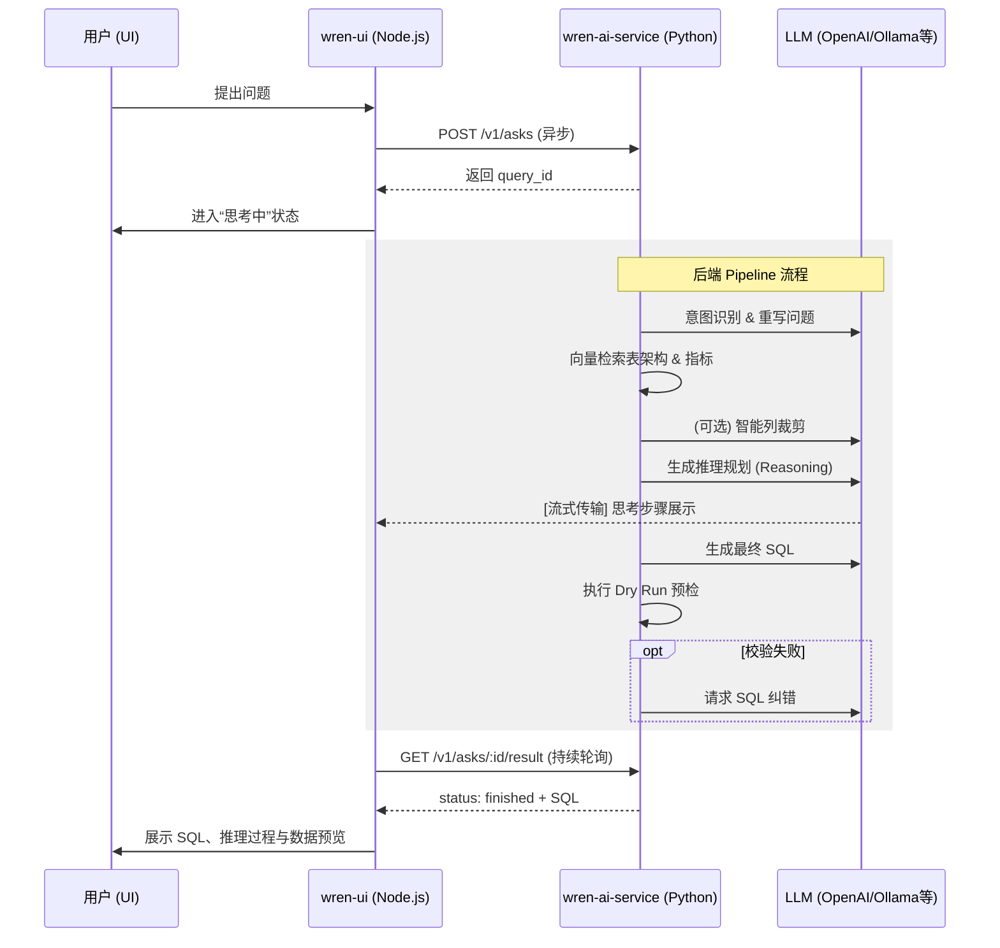

# WrenAI 请求-响应流程全栈详解

  本文档提供从用户在 UI 提问到最终生成 SQL 答案的全流程解析，涵盖了前端协调与后端 AI 管道的深度细节。
  
## 1. 整体架构与流程入口

WrenAI 的处理流程跨越了 **wren-ui** (Apollo Server) 和 **wren-ai-service** (FastAPI) 两个核心组件。

### 阶段一：前端捕获与任务初始化

1. **用户提问**: 用户在 UI 输入问题并提交。
2. **GraphQL 触发**: `wren-ui` 发起 mutation 触发 [AskingService](../wren-ui/src/apollo/server/services/askingService.ts)。
3. **API 调用**: UI 服务端通过 `WrenAIAdaptor` 向 `wren-ai-service` 发起 `POST /v1/asks` 请求。
4. **快速响应**: `wren-ai-service` 返回一个唯一的 `query_id`，UI 立即将此 ID 反馈给前端并进入轮询状态。

---
## 2. 核心 AI 管道逻辑 (后台异步处理)

一旦接收到请求，`AskService` 会在后台启动一套基于 Pipeline 的复杂逻辑处理。

### 阶段二：意图识别与问题重写 (Intent Classification)

- **问题重写 (Rephrase)**: 结合对话历史，将用户的短语或追问重写为独立的完整问题。
- **意图分类**: 根据检索到的表描述和文档，判断属于以下哪种意图：
	- `TEXT_TO_SQL`: 需要生成数据库查询。
	- `GENERAL`: 宽泛的元数据提问（如“这个数据集是关于什么的？”）。
	- `USER_GUIDE`: 工具用法咨询。
	- `MISLEADING_QUERY`: 无意义或不相关的提问。

### 阶段三：架构检索与智能裁剪 (Schema Retrieval & Column Pruning)

目的是过滤出回答问题所需的最小数据集。
- **向量检索**: 寻找语义最接近的物理表结构。
- **列裁剪 (Pruning)**:
	- 如果检索到的 DDL 长度超过 LLM 的上下文限制，会触发 **LLM 智能裁剪**。
	- LLM 分析问题并精准选出所需的列名，系统据此构建动态压缩版的 DDL。
- **元数据补充**: 识别计算字段（Calculated Field）和指标（Metric），并附加特定生成规则。

### 阶段四：规划、生成与流式反馈 (Reasoning & Generation)

- **推理规划 (Reasoning Plan)**: LLM 首先生成逻辑步骤（例如：先关联用户表，按日期过滤，再求销售额总和）。
- **实时流 (Streaming)**: 这些步骤会实时推送到 UI 中，即用户看到的“Thinking Process”。
- **SQL 生成**: 结合 Reason Plan、压缩 DDL、Few-shot 示例生成最终的 ANSI SQL。

### 阶段五：校验与纠错循环 (Dry Run & Correction)

- **Dry Run**: 调用数据库引擎进行语法和权限校验（不实际出数据）。
- **纠错循环**:
	- 若校验失败，捕获错误日志。
	- 将“原 SQL + 错误消息 + 架构”重新喂给 LLM 进行诊断和修复。
	- *默认最多重试 3 次*，确保返回的是可执行代码。

---

## 3. 全流程泳道图 (Mermaid)

  

  

---

  

## 4. 如何查看相关实现？

- **UI 入口**: [askingService.ts](../wren-ui/src/apollo/server/services/askingService.ts)
- **AI 服务入口**: [ask.py](../wren-ai-service/src/web/v1/routers/ask.py)
- **Pipeline 定义**:
	- [意图识别](../wren-ai-service/src/pipelines/generation/intent_classification.py)
	- [架构检索](../wren-ai-service/src/pipelines/retrieval/db_schema_retrieval.py)
	- [SQL 推理](../wren-ai-service/src/pipelines/generation/sql_generation_reasoning.py)
	- [SQL 生成](../wren-ai-service/src/pipelines/generation/sql_generation.py)
	- [SQL 纠错](../wren-ai-service/src/pipelines/generation/sql_correction.py)